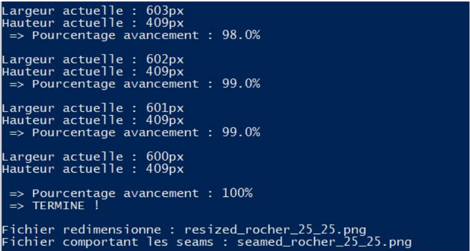
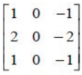
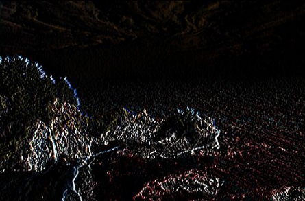
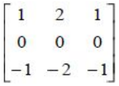
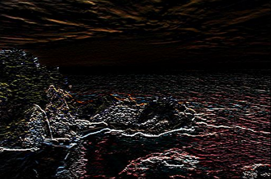
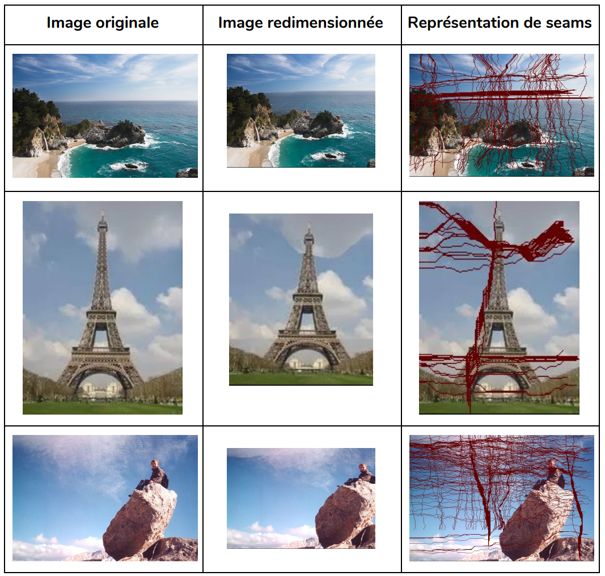

*Travail réalisé dans le cadre d'un projet étudiant en seconde année du cycle préparatoire intégré (E2) à ESIEE Paris*
# Seam-Carving

## User guide

Ces instructions permettent de faire tourner l'application sur votre machine.
S'insurer que java est bien installé sur votre machine, puis taper la commande suivante : 
````
java SeamCarving (nomImage.png) (%RéductionHauteur) (%RéductionLargeur)
````
Par exemple, si je veux réduire mon image “chaton.png” de 10% en hauteur et de 20% en largeur, je dois taper la commande suivante :

````
java SeamCarving chaton.png 10 20
````

Vous devrez placer votre image à redimensionner dans le dossier “Exercice2/images”. Votre image redimensionnée se trouvera dans le dossier “resized_images” sous le nom suivant : nomImage_%Hauteur_%Largeur.png
(chaton_10_20.png pour notre exemple).
Une autre image (seamed_…) accompagnera celle qui est redimensionnée, elle correspond au tracé des seams déterminés sur l’image.

Une fois le programme lancé, celui-ci progressera plus ou moins rapidement en fonction de la taille de votre image et du pourcentage de redimensionnement. Un pourcentage d’avancement sera disponible comme ceci :


## Introduction

Après avoir bien compris la technique du Seam Carving, nous avons commencé à définir les logiques primaires de notre programme. Voilà pourquoi les fonctions se distinguent en trois parties :
- Celles nécessaires à l’ouverture de l’image et à la récupération de ses données pour pouvoir les manipuler (ex : conversion de l’image en tableau de pixels contenant les valeurs RGB de chaque pixel).
- Celles qui manipulent directement les données de l’image pour les analyser et les traiter afin d’effectuer directement le Seam Carving (ex : l’application de filtres par convolution).
- Celles qui créent l’image et le nouveau fichier une fois le traitement du Seam Carving terminé (conversion des tableaux en image et création du fichier png).

L’essentiel de ce rapport se concentrera directement sur les fonctions de la deuxième partie, qui nous intéressent ici pour le traitement du Seam Carving et le redimensionnement de l’image.

Vous pourrez remarquer que nous avons décidé d’utiliser une nomenclature particulière pour nos variables en y ajoutant des préfixes qui suivent une logique simple :
- **a**NomVariable : attribut
- **v**NomVariable : variable locale d’une fonction
- **p**NomVariable : paramètre
Afin de pouvoir manipuler plus simplement l’image, nous la convertissons directement en un tableau à double dimensions contenant les valeurs RGB de chaque pixel ayant un nombre aHauteurImage de lignes et aLargeurImage de colonnes.

## Analyse de l’image et tableaux des coûts minimums

Après avoir chargé l’image nous allons devoir, à partir des valeurs RGB des pixels et avec l’application de filtres, obtenir “l’énergie” de chaque pixel pour ensuite déterminer des tableaux des coûts minimums qui permettront de définir les seams des pixels à retirer de l’image.

### Définition des énergies des pixels 

La première étape consiste donc à définir “l’énergie” de chaque pixel. Elle correspond à une valeur plus ou moins importante associée au pixel, selon s’il correspond à une zone importante de l’image (typiquement les angles, les coins, les contours…) ou au contraire à une zone moins importante, avec moins de détails (ex : les zones uniformes). La question est donc bien-sûr : Comment définir l’énergie des pixels ?

### Les filtres

On détermine cette “énergie” pour chaque pixel par l’application de filtres sur l’image. Ils correspondent à des matrices, il en existe différents types pour différentes applications. L’algorithme va donc effectuer une convolution entre l’image et cette matrice qui modifiera la valeur des pixels. Dans notre cas les filtres que nous utilisons permettent de faire ressortir les pixels des contours, des angles, des coins sur l’image. La valeur d’un pixel dépend donc obligatoirement des valeurs des pixels voisins.

Par exemple, voici l’image originale représentant d’un paysage de bord de mer.


#### Le filtre vertical



Ce filtre, aussi appelé filtre de Sobel vertical, est le premier que l’on utilise. Il permet de détecter les contours et les angles verticalement dans l’image.

Voici l’image **aEnergyImageVertical** après application du filtre de Sobel vertical. On distingue bien les contours des rochers.



#### Le filtre horizontal



Ce filtre, aussi appelé filtre de Sobel horizontal, est le deuxième que l’on va utiliser. Il permet lui aussi de détecter les contours et les angles dans l’image mais horizontalement cette fois-ci.

Voici l’image **aEnergyImageHorizontal** après application du filtre de Sobel horizontal. Par rapport à l’image précédente on distingue mieux les vagues par exemple.



Pour appliquer techniquement les filtres on utilise un objet **Kernel** qui correspond à la matrice du filtre nécessaire pour la convolution. On effectue ensuite la convolution
en utilisant l’objet **ConvolOp convolution = ConvolOp(Kernel)**. **aEnergyImage** est donc définie par :
**aEnergyImage** = *convolution.filter(aImage, null);*

### Détermination des seams

Après avoir défini les valeurs des pixels grâce aux filtres et aux merveilleuses fonctions mathématiques, nous pouvons directement les manipuler pour enfin appliquer notre Seam Carving. Nous avons d’abord compris qu’un Seam correspond à un chemin de pixels de plus faible coût possible, on peut directement faire l’analogie avec le premier exercice de la coccinelle, cependant, certaines différences s’ajoutent ici:

- Bien entendu, le but ici est de faire l’inverse de la coccinelle qui elle voulait trouver un chemin de plus fort coût possible et ainsi manger un nombre maximal de pucerons.
- Étant donné que nous voulons réduire la taille de l’image verticalement et horizontalement, nous devons pouvoir déterminer des seams verticaux et horizontaux (de bas en haut et de gauche à droite), là où la coccinelle n’avait besoin de parcourir le tableau seulement de bas en haut.

Ainsi, en reprenant directement la même logique que la coccinelle, nous prenons le tableau **aCostTable** vertical ou horizontal selon si l’on souhaite déterminer un seam sur la hauteur ou la largeur de l’image.

#### Seam vertical

Un Seam vertical est une suite de pixels de plus faible valeur déterminée à partir de **aEnergyImageVertical** qui parcourt la grille de haut en bas. Ainsi, en retirant un seam vertical, cela nous permet de réduire la taille de l’image en largeur.

L’algorithme débute sur une des cases de la ligne L = 0 et remonte ensuite jusqu’à la ligne **L = aHauteurImage** en essayant d’emprunter le chemin de plus faible coût possible. Nous voulons que notre programme parcourt la grille verticalement, donc ses déplacements possibles sont “Nord”, “Nord-Ouest” et “Nord-Est” (N, NO, NE).

On dispose de fonctions int n(int L, int C), no (int L, int C), ne(int L, int C) : coûts d’un déplacement depuis la case (L, C) dans une grille à aHauteurImage lignes et aLargeurImage colonnes, correspondant respectivement aux déplacements Nord, Nord-Ouest et Nord-Est.

- Le programme étant sur la case (L-1, C), le déplacement Nord le conduit en case (L, C) avec un coût n(L-1, C).
- Étant sur la case (L-1,C-1), le déplacement Nord-Est le conduit en case (L, C) avec un coût ne(L-1,C-1).
- Étant sur la case (L-1, C+1), le déplacement Nord-Ouest le conduit en case (L, C) avec un coût no(L-1, C+1)

Afin que le programme ne sorte pas de la grille, les mouvements Nord, Nord-Ouest et Nord-Est depuis une case située en ligne L >= aHauteurImage sont de coût infini. De même pour le mouvement Nord-Est depuis une case située en colonne C >= aLargeurImage et pour le mouvement Nord-Ouest depuis une case située en colonne C<0.

On note m(l, c), le coût minimum d’un chemin allant d’une case à la ligne L = 0 jusqu’à la case (l, c).

Nous avons créé un tableau int[][] aCostTableVertical = new int[aHauteurImage][aLargeurImage]. Son but est de regrouper toutes les valeurs m(l, c) à partir de aEnergyImageVertical. C’est la fonction calculCostTableVertical qui va déterminer ce tableau en prenant en paramètre une image, sa largeur et sa hauteur.

Le coût minimum m(L, C) ∀L, ∀C, 0 ≤ L ≤ aHauteurImage, 0 ≤ C ≤ aLargeurImage peut correspondre soit à :

- m(L-1, C) + n(L-1, C)
- m(L-1, C-1) + ne(L-1, C-1)
- m(L-1, C+1) + no(L-1, C+1)

Ainsi, pour déterminer m(L, C), on choisit le résultat le plus faible parmi ces trois grâce à la fonction Math.min.

Grâce à ce tableau **aCostTableVertical**, nous pouvons désormais être en mesure de déterminer le chemin de plus faible coût possible que le programme doit prendre de la ligne L=0 jusqu’à la ligne L=**aHauteurImage**, à l’aide d’une autre fonction **seamFinderVertical** qui prend en paramètre des coordonnées L et C pour retracer le chemin de plus faible coût qui a mené jusqu’à ces coordonnées L et C. Nous devons donc, en premier lieu, déterminer à quelle case le chemin se termine, c’est à dire que  nous devons trouver à quelle colonne se situe le pixel de plus faible valeur à la ligne L = **aHauteurImage**. Nous déterminons cette case grâce à la fonction **plusFaibleCoutVertical**, qui stocke dans les attributs **aYmaxVertical** (=aHauteurImage en l’occurence) et **aXmaxVertical** les coordonnées de cette case.

Nous pouvons ainsi lancer **seamFinderVertical** en y mettant en paramètres L=**aYmaxVertical**, C=**aXmaxVertical**. Désormais, à partir de cette case, la fonction va directement tester si, la valeur de la case (L, C) actuelle correspond soit à :

- La valeur de la case m(L-1, C)+n(L-1, C)
*(ce qui voudrait dire que pour accéder à la case actuelle (L, C), elle a dû prendre la direction
Nord).*
- La valeur de la case m(L-1, C-1)+ne(L-1, C-1)
*(ce qui voudrait dire que pour accéder à la case actuelle (L, C), elle a dû prendre la direction
Nord-Est).*
- La valeur de la case m(L-1, C+1)+no(L-1, C+1).
*(ce qui voudrait dire que pour accéder à la case actuelle (L, C), elle a dû prendre la direction
Nord-Ouest).*

Si l’une des trois égalités est vérifiée, on en déduit quelle est la case précédente (L-1, C), (L-1, C-1) ou (L-1, C+1). La fonction est récursive et teste de nouveau la même chose avec la case précédente trouvée et ainsi de suite jusqu’à arriver à la ligne L=0. Notre chemin de plus faible coût a été établi, c’est notre seam ! Chaque coordonnées de cases trouvées ont été stockées dans un tableau aVerticalSeamTab qui correspond donc à notre seam.

#### Seam horizontal 

Un Seam horizontal est une suite de pixels de plus faible valeur déterminée à partir de **aEnergyImageHorizontale** qui parcourt la grille de gauche à droite. Ainsi, en retirant un seam horizontal, cela nous permet de réduire la taille de l’image en hauteur.

Le principe pour retrouver un seam horizontal reprend les mêmes bases que le seam vertical, sauf que cette fois-ci, on veut que le programme parcourt l’image en horizontal, d’une case de la colonne C = 0 jusqu’à une case de la colonne C = **aLargeurImage** en essayant d’emprunter le chemin de plus faible coût possible. Nous voulons que notre programme parcourt la grille horizontalement, donc ses déplacements possibles sont “Est”, “Nord-Est” et “Sud-Est” (E, NE, SE).

On dispose de fonctions int **e**(int L, int C), **ne** (int L, int C), **se**(int L, int C) : coûts d’un déplacement depuis la case (L, C) dans une grille à **aHauteurImage** lignes et **aLargeurImage** colonnes, correspondant respectivement aux déplacements Est, Nord-Est et Sud-Est.

- Le programme étant sur la case (L, C-1), le déplacement Est le conduit en case (L, C) avec un coût **e**(L, C-1).
- Étant sur la case (L-1,C-1), le déplacement Nord-Est le conduit en case (L, C) avec un coût **ne**(L-1,C-1).
- Étant sur la case (L+1, C-1), le déplacement Sud-Est le conduit en case (L, C) avec un coût **se**(L+1, C-1).

Afin que le programme ne sorte pas de la grille, les mouvements Est, Nord-Est et Sud-Est depuis une case située en colonne C >= **aLargeurImage** sont de coût infini. De même pour le mouvement Nord-Est depuis une case située en ligne L >= **aHauteurImage** et pour le mouvement Sud-Est depuis une case située en ligne L<0. 

On note **m(l, c)**, le coût minimum d’un chemin allant d’une case à la ligne C = 0 jusqu’à la case (l, c).

Comme pour le seam vertical, nous avons créé un tableau **aCostTableHorizontal** son but est de regrouper toutes les valeurs **m(l, c)** à partir de **aEnergyImageHorizontal**. Nous avons en effet besoin de tableaux de coûts différents pour les seams horizontaux et verticaux étant donné que les coûts varient en fonction du sens duquel le programme parcourt la grille. C’est la fonction **calculCostTableHorizontal** qui va déterminer ce tableau en prenant en paramètre une image, sa largeur et sa hauteur.

Le coût minimum **m(L, C)** ∀L, ∀C, 0 ≤ L ≤ aHauteurImage, 0 ≤ C ≤ aLargeurImage peut correspondre soit à :

- m(L, C-1) + **e**(L, C-1)
- m(L-1, C-1) + **ne**(L-1, C-1)
- m(L+1, C-1) + **se**(L+1, C-1)

Maintenant, à l’aide du tableau **aCostTableHorizontal**, on peut déterminer le chemin de plus faible coût possible d’une case de la colonne C=0 jusqu’à une case de la colonne C = **aLargeurImage**. Nous faisons intervenir la fonction **seamFinderHorizontal** qui fonctionne exactement comme **seamFinderVertical**, sauf que cette fois-ci, pour la lancer nous devons trouver deux attributs **aYmaxHorizontal** et **aXmaxHorizontal** qui correspondent aux coordonnées de la case de plus faible valeur sur la colonne C = **aLargeurImage**: c’est la fonction **plusFaibleCoutHorizontal** qui s’en charge.

Nous pouvons ainsi lancer **seamFinderHorizontal** en mettant en paramètres L=**aYmaxHorizontal**, C=**aXmaxHorizontal**. Désormais, à partir de cette case, la fonction va directement tester si, la valeur de la case (L, C) actuelle correspond soit à :

- La valeur de la case **m**(L, C-1)+**e**(L, C-1)
*(ce qui voudrait dire que pour accéder à la case actuelle (L, C), elle a dû prendre la direction Est).*
- La valeur de la case **m**(L-1, C-1)+**ne**(L-1, C-1)
*(ce qui voudrait dire que pour accéder à la case actuelle (L, C), elle a dû prendre la direction Nord-Est).*
- La valeur de la case **m**(L+1, C-1)+**se**(L+1, C-1).
*(ce qui voudrait dire que pour accéder à la case actuelle (L, C), elle a dû prendre la direction Sud-Est).*

La fonction re-teste chaque case jusqu’à arriver à la colonne C = 0. Chaque coordonnées de cases trouvées ont été stockées dans un tableau **aHorizontalSeamTab** qui correspond donc à notre seam.

## Redimensionnement de l'image

Nous venons de voir la logique de la détermination d’un seam de l’image. Désormais, ils nous faut pouvoir retirer ces pixels de l’image pour la redimensionner.

En premier lieu, on calcule la nouvelle hauteur (**aNewHauteurImage**) et la nouvelle largeur (**aNewLargeurImage**) à partir du pourcentage de réduction entré dans la ligne de commande.

Ensuite, nous utilisons le seam correspondant au redimensionnement actuel (en largeur => vertical ou en hauteur => horizontal). Ce dernier contenant les coordonnées des pixels à retirer de l’image, nous avons choisi d’utiliser la méthode suivante :

- On crée une nouvelle grille de taille **aLargeurImage**-1 ou **aHauteurImage**-1, on commence par remplir normalement cette dernière en faisant correspondre les pixels de l’image.

- Cependant, en parcourant la grille, pour chaque pixel, si les coordonnées du pixel actuel se trouvent aussi dans le seam que l’on utilise alors nous n’ajoutons pas ce pixel à la grille.

- Enfin, pour éviter que le seam apparaisse sur l’image comme un chemin de pixels noir, tous les pixels suivant un pixel non-ajouté sur la même ligne (pour une redimensionnement vertical) ou sur la même colonne (pour l’horizontal) sont décalés à gauche ou en haut respectivement.

Maintenant, au lieu que notre programme détermine tous les seams d’un coup et les retire de l’image en une seule fois, nous avons préféré une approche beaucoup plus optimale, bien que plus longue. En effet, le retrait d’un seam provoque un changement notable dans l’image, ainsi la valeur de l’énergie des pixels peut varier. Ainsi, après le retrait d’un seam, nous répétons toute l’opération (analyse de l’image, application d’un filtre, nouvelle **costTable**, détermination d’un nouveau seam…) pour prendre en compte le changement potentiel des valeurs d’énergie des pixels.

Pour aller plus loin dans l’optimisation, nous devons savoir s’il y a plus de seams verticaux ou horizontaux pour savoir à quelle fréquence les calculer. En effet, s’il y a 40 seams verticaux et 20 seams horizontaux à retirer et que le programme les traite logiquement, sans différence, il va commencer par retirer un à un les 20 premiers seams verticaux, les 20 seams horizontaux et continuera à retirer 20 derniers seams verticaux pour arriver à 40. Or, le retrait de ces 20 derniers seams verticaux a pu considérablement changer la valeur de l’énergie des pixels et peut avoir un impact considérable sur le redimensionnement horizontal.

Pour y remédier, nous voulons que le programme retire des seams horizontaux tout au long de la procédure, pour avoir un redimensionnement le plus juste possible. Il va s’adapter : pour 2 seams verticaux retirés, un seam vertical est retiré. Cela nous donne une itération de la sorte (dans le cas où il y a plus de seams verticaux) :

➢ Seam vertical retiré ✓ - Seam horizontal retiré ✓
➢ Seam vertical retiré ✓
➢ Seam vertical retiré ✓ - Seam Horizontal retiré ✓
➢ Seam vertical retiré ✓

Nous avons préféré utiliser cet exemple (40 seams verticaux vs 20 seams horizontaux) car il est plus simple à présenter. Bien entendu, le programme saura s’adapter pour tous les nombres possibles, même si le nombre de seams ne sont pas multiples entre eux.

Il s’avère que toute ce processus de ré-analyser l’image à chaque itération s’avère plutôt long car nous devons créer une image à chaque fois. Pour y remédier, nous pourrions nous attarder sur la fonction **convolution.filter** (qui créée le filtre) qui nécessite obligatoirement une image en paramètre et la redéfinir pour qu’elle prenne en paramètre une grille.

## Exemples d'exécutions

Voici plusieurs exemple d’application de notre Seam Carving sur différentes images.

- La première image du tableau (plage.png) a été redimensionnée de **10% en hauteur** et **20% en largeur**.
- La deuxième (tour.png) est redimensionnée de **20% en largeur** et de **10% sur la hauteur.**
- Enfin, la troisième image (rocher.png) a été redimensionnée proportionnellement sur la **largeur et la hauteur** à savoir de **25%**.



**(Vous pourrez remarquer que les seams ne prennent pas forcément toute la largeur our toute la longueur car en effet, on créée un seam à chaque fois que l'image est réduite, il se termine donc à la largeur/longueur de son itération).
